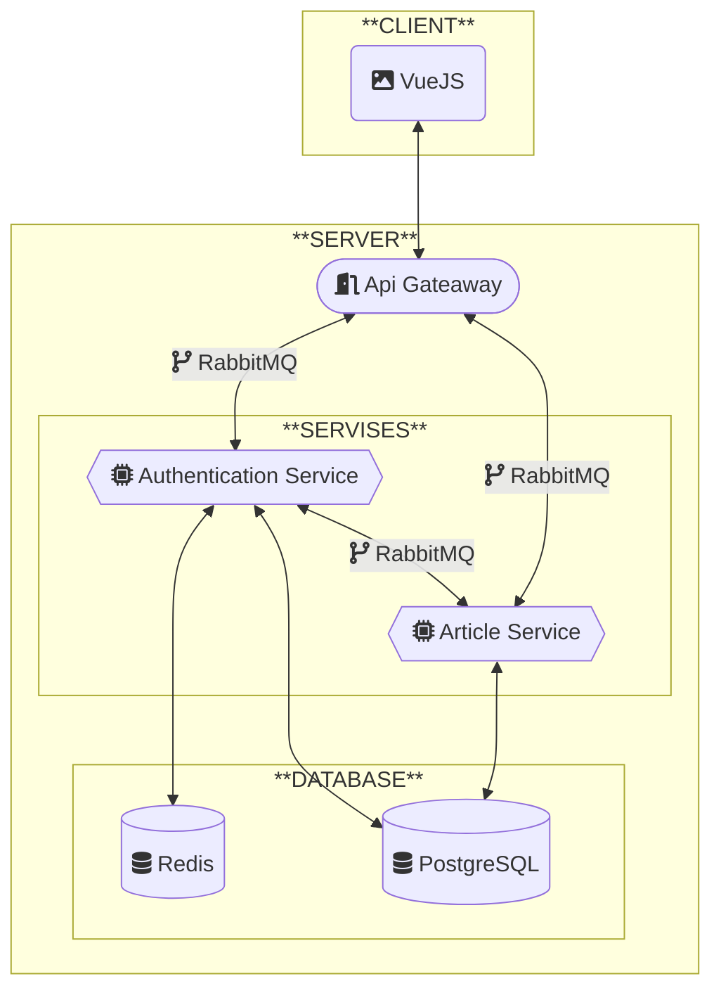

# Описание
Проект для изучения процесса
создания приложения на микросервисной архитектуре
с использованием GraphQL и RabbitMQ.\
Сервис для работы со статьями.
# Требования
- [ ] Авторизация с помощью JWT-токенов (по email и паролю)
- [ ] Запуск через docker compose
- [ ] Сервисы должны общаться через RabbitMQ посредством GraphQL
- [ ] CRUD операции над статьями
# Структура

# Стек технологий

<details>
<summary>
БД
</summary>

* Redis
* PostgreSQL

</details>

# Документация
# Тесты
# Запуск и развертывание
Для запуска на компьютере должен быть установлен и запущен Docker.

| Процесс    | Порт | Открыт |
| ---------- | ---- | ------ |

Первый запуск (команды выполняются в директории с `compose.yaml`)
```bat
docker compose up --build
```
Все последующие запуски
```bat
docker compose up
```
