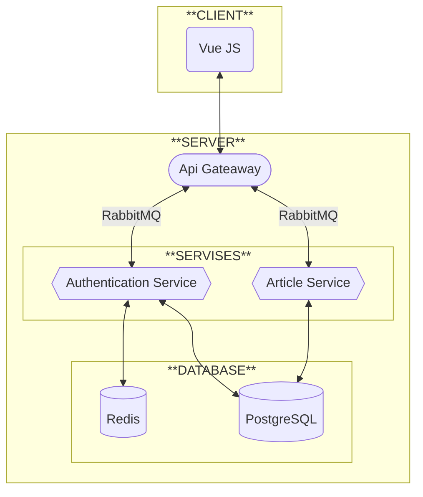

# 📃Описание
Проект для изучения процесса
создания приложения на микросервисной архитектуре
с использованием GraphQL.\
Сервис для работы со статьями.
## 🔥Основные моменты
* 🔶Spring
* 🔶GraphQL
  * 🔶Validation
  * 🔶Custom Types
    * 🔶Local Date Time
* 🔶Microservices
* 🔶JWT-Authentication
# 📗Требования
- [x] Аутентификация с помощью JWT-токенов (по email и паролю)
- [x] Запуск через docker compose
- [ ] Клиент должен быть написан с помощью Vue JS
- [x] Сервисы должны иметь общую точку входа
- [x] CRUD операции над статьями
- [x] В качестве протокола взаимодействия должен использоваться GraphQL
# 🎨Структура

# 🔧Стек технологий

<details>
<summary>
<big>БД</big>
</summary>

* Redis
* PostgreSQL

</details>

# 📚Документация
<details>
<summary>
<big>Authentication Service</big>
</summary>

### Схема

```graphql
scalar LocalDateTime

directive @Pattern(message: String! = "Поле должно быть формата: example@example.example", regexp: String! = "\\S+@\\S+\\.\\S+") on ARGUMENT_DEFINITION | INPUT_FIELD_DEFINITION
directive @Size(min: Int! = 8, max: Int! = 21000, message: String! = "Поле должно состоять из минимум 8 символов") on ARGUMENT_DEFINITION | INPUT_FIELD_DEFINITION

type User{
    id: ID!
    email: String!
    createdAt: LocalDateTime!
    lastLogin: LocalDateTime!
}

type JwtTokenResponse{
    accessToken: String!
    refreshToken: String!
}

type Query{
    currentUser: User!
}

type Mutation{
    authenticate(email: String! @Pattern, password: String! @Size): JwtTokenResponse!
    register(email: String! @Pattern, password: String! @Size): JwtTokenResponse!
    refreshToken(refreshToken: String!): JwtTokenResponse!
    #None
    logout: Int

    updateUser(password: String! @Size): User!
}
```

</details>

<details>
<summary>
<big>Article Service</big>
</summary>

### Схема

```graphql
type ArticleEntity {
    id: ID!
    title: String!
    content: String!
}

type Query {
    getAllArticles: [ArticleEntity!]!
    getArticle(id: ID): ArticleEntity!
}

type Mutation {
    createArticle(title: String!, content: String!): ArticleEntity!
    updateArticle(id: ID!, title: String, content: String): ArticleEntity!
    #None
    deleteArticle(id: ID!): Int
}
```

</details>

# 📈Тесты
# 🚩Запуск и развертывание
Для запуска на компьютере должен быть установлен и запущен Docker.

|         Процесс         |  Порт  | Открыт*  |
|:-----------------------:|:------:|:--------:|
|     Article Service     |  8081  |   Нет    |
| Authentication Service  |  8082  |   Нет    |
|       PostgreSQL        |  5432  |   Нет    |
|          Redis          |  6379  |   Нет    |
|         PgAdmin         | 15432  |    Да    |
|      Api Gateaway       |  8080  |    Да    |

> *для внешнего клиента

Первый запуск (команды выполняются в директории с `compose.yaml`)
```bat
docker compose up --build
```
Все последующие запуски
```bat
docker compose up
```
